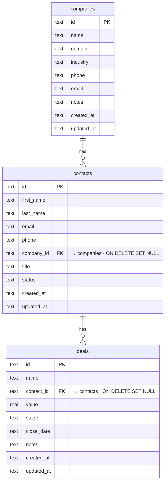

# OpenCRM: The Open-Source HubSpot Alternative for SaaS

[](https://app.clawnify.com/deploy?repo=clawnify/OpenCRM)

A lightweight CRM with contacts, companies, and deals — built for SaaS dashboards and AI agents. Part of the [OpenClaw](https://github.com/openclaw/openclaw) ecosystem. Zero cloud dependencies — runs locally with SQLite.

Built with **React + Tailwind + shadcn/ui** on **Hono + Cloudflare D1**. Path-based routing, UUID keys, a dark mode that follows the OS, and a dual-mode UI: one for humans and one for AI agents (larger targets, always-visible actions).

## What Is It?

OpenCRM is a production-ready contact relationship manager designed for the OpenClaw community. Think of it as an open-source HubSpot alternative — a CRM you can self-host, customize, and embed in any SaaS product.

Unlike HubSpot or Salesforce, this runs entirely on your own infrastructure with no API keys, no vendor lock-in, and no per-seat pricing. It provides a complete sales pipeline and lead management system. Manage contacts, companies, and deals with rich column types, inline editing, and full CRUD — all out of the box.

## Features

- **Three entities** — contacts, companies, and deals with foreign-key relationships (UUID keys, not enumerable ids)
- **Activity timeline** — every contact/company/deal has a feed; emails, meetings, notes, and deal-won events all log to it
- **Integrations (Clawnify connections)** — email a contact via Gmail, schedule a Google Calendar meeting, and post to Slack when a deal is won — all through the org's Clawnify connections, no keys in the app
- **CSV / XLSX import** — upload a spreadsheet, map columns to fields (exact-match auto-mapping), preview, import; company names resolve to existing companies or are created
- **Deal pipeline** — a board tracking deals through stages (prospect → qualified → proposal → negotiation → won/lost) with per-column totals
- **Path routing** — deep-linkable views and records: a row opens in a side panel beside the list (`/contacts?record=:id`), and expands to its full page (`/contacts/:id`)
- **Rich cells** — avatars, category badges, company favicons, tabular currency, email/phone links
- **Sorting, search, pagination** — server-side, debounced
- **Filters** — one chip per field (text contains/is, number ranges, multi-value status, dates: on, before, after, today, past/next N days/weeks/months), plus an advanced filter of rules joined by AND/OR with one level of rule groups; Open a list pre-filtered with `?filters=` (the same JSON the API takes)
- **Views** — named, shared views of each list ("All contacts" is the default): each keeps its own filters, sort and columns. Switch from the view bar, add one from the list as it is, edit a name in place, delete one; Update view saves your changes to it for everyone, Reset drops them
- **Relations** — link any two record types from Settings → Attributes ("each contact has one partner company", "each company has many subsidiaries", a record type to itself included). Both sides appear at once: the single link as a chip you pick from a search, the many side as a list on the record with "+" to link and × to unlink. The single side sorts by the linked record's name and filters with is / is not / empty; deleting a record clears the links to it
- **Edit in the grid** — click a cell to change it in place: text in an input over the cell (Enter or a click away saves, Escape drops it), a status or linked record from a list under it; email and phone cells copy on hover
- **Record grid** — the name column and header stay pinned while you scroll; columns are resizable (drag the divider) and hideable (the `+` at the end of the header), and the layout is saved on the list's view for the whole org; tick rows to export them as CSV or delete them in bulk; a footer calculates each column over the whole filtered list (count, empty %, unique, sum, average, min/max, earliest/latest), and "+ Add new" sits under the last row
- **Dual-mode UI** — human-optimized + AI-agent-optimized (`?agent=true`); dark mode follows the OS

## Quickstart

```bash
git clone https://github.com/clawnify/OpenCRM.git
cd open-crm
pnpm install
pnpm run dev
```

Open `http://localhost:5175` in your browser. Data persists in `data.db`.

### Agent Mode (for OpenClaw / Browser-Use)

Append `?agent=true` to the URL:

```
http://localhost:5175/?agent=true
```

This activates an agent-friendly UI with:
- Explicit "Edit" / "Delete" buttons on every row (no hover-to-reveal)
- Larger click targets for reliable browser automation
- Always-visible action buttons
- Semantic labels on all interactive elements

The human UI stays unchanged — hover-to-reveal actions, compact spacing, and a clean interface.

## Tech Stack

| Layer | Technology |
|-------|-----------|
| **Frontend** | React 19, Tailwind v4, shadcn/ui, TypeScript, Vite |
| **Backend** | Hono on Cloudflare Workers |
| **Database** | Cloudflare D1 (SQLite) via `@clawnify/db` |
| **Integrations** | `@clawnify/connections` (Gmail, Google Calendar, Slack) |
| **Icons** | Lucide |
| **Favicons** | Favicone |

### Prerequisites

- Node.js 20+
- pnpm (or npm/yarn)

## Architecture

```
src/
  server/
    schema.sql  — SQLite schema (companies, contacts, deals)
    db.ts       — SQLite wrapper + seed logic (5 companies, 10 contacts, 8 deals)
    index.ts    — Hono REST API (full CRUD for all three entities + stats)
  client/
    app.tsx             — Root component + agent mode detection
    context.tsx         — Preact context for CRM state
    hooks/use-crm.ts    — Multi-entity state management
    components/
      sidebar.tsx         — Entity navigation with count badges
      toolbar.tsx         — Entity title + search + add button
      data-table.tsx      — Table orchestrator
      contacts-table.tsx  — Contact rows (avatar, company, status pill)
      companies-table.tsx — Company rows (favicon, industry pill, contact count)
      deals-table.tsx     — Deal rows (contact, value, stage pill, footer totals)
      add-form.tsx        — Slide-down forms for adding records
      pill.tsx            — Colored status/stage pill
      avatar.tsx          — Initial-based colored avatar
      entity-icon.tsx     — Company favicon with letter fallback
      pagination.tsx      — Page controls
```

### Data Model

Three entities with foreign key relationships:



```sql
companies (id, name, domain, industry, phone, email, notes)
contacts  (id, first_name, last_name, email, phone, company_id → companies, title, status)
deals     (id, name, contact_id → contacts, value, stage, close_date, notes)
```

Contacts belong to companies. Deals belong to contacts (and inherit the company). Deleting a company sets `company_id` to NULL on its contacts. Deleting a contact sets `contact_id` to NULL on its deals.

Custom attributes are real columns, registered in `custom_field_defs`. A relation is two defs, one per side, pointing at each other (`inverse_def_id`). The single side (`many_to_one`) is an indexed column holding the linked record's id, its key ending in `_id`; the many side (`one_to_many`) has no column and is read back from it. Relation columns carry no foreign key, since SQLite can't drop a column that has one; the API clears links when a record is deleted.

### API Endpoints

Reads carry each relation under `relations[key]`: the linked record `{ id, label, domain }` (or null), or for a many side `{ items, total }`. Write the single side by id (`PUT /api/contacts/:id { "partner_company_id": "<company id>" }`, null to clear); the many side is written from the records it lists.

List endpoints take `filters`: a JSON list, ANDed, of rules `{field, op, value}` and groups `{logic: "and"|"or", rules: [...]}` (groups nest one level). Operators: `contains`, `does_not_contain`, `is` / `is_not` (a value or a list, case-insensitive), `is_empty`, `is_not_empty`, `gt` / `gte` / `lt` / `lte`, and for dates `on`, `before`, `after` (on or after), `today`, `in_past`, `in_future`, `relative` (`PAST_7_DAY`, `NEXT_2_WEEK`, `THIS_1_MONTH`). Pass `tz` (minutes east of UTC) to put date rules on the viewer's local day.

| Method | Endpoint | Description |
|--------|----------|-------------|
| GET | `/api/stats` | Aggregate counts and total deal value |
| GET | `/api/contacts` | List contacts (paginated, sortable, searchable) |
| POST | `/api/contacts` | Create a contact |
| PUT | `/api/contacts/:id` | Update a contact |
| DELETE | `/api/contacts/:id` | Delete a contact |
| POST | `/api/contacts/bulk-delete` | Delete several contacts (`{ ids }`) |
| GET | `/api/companies` | List companies (paginated, sortable, searchable) |
| POST | `/api/companies` | Create a company |
| PUT | `/api/companies/:id` | Update a company |
| DELETE | `/api/companies/:id` | Delete a company |
| POST | `/api/companies/bulk-delete` | Delete several companies (`{ ids }`) |
| GET | `/api/deals` | List deals (paginated, sortable, searchable) |
| POST | `/api/deals` | Create a deal |
| PUT | `/api/deals/:id` | Update a deal |
| DELETE | `/api/deals/:id` | Delete a deal |
| GET | `/api/views?entity=` | A list's named views (its default "All …" view is created on first use) |
| POST | `/api/views` | Create a view (`{ entity, name, from?, filters?, sort?, order? }`; `from` copies that view's columns) |
| PATCH | `/api/views/:id` | Rename a view or update its filters and sort |
| DELETE | `/api/views/:id` | Delete a view (not the default) |
| GET | `/api/views/:id/fields` | A view's column layout (visibility, widths, footer calculations) |
| PUT | `/api/views/:id/fields/:key` | Show/hide, resize or set the footer calculation of one column (`{ visible?, size?, aggregate? }`) |
| POST | `/api/custom-fields` | Add an attribute. A relation: `{ entity_type, key, label, field_type: "relation", relation_type: "many_to_one" \| "one_to_many", target_entity, inverse_key, inverse_label }` makes both sides |
| DELETE | `/api/custom-fields/:id` | Delete an attribute (a relation goes from both sides, with its links) |
| GET | `/api/records?entity=&search=` | Records by name for a relation picker (or `ids=a,b` to name given ids) |
| GET | `/api/contacts/aggregates`, `/api/companies/aggregates` | Column totals over the filtered list (`ops=[{key, op}]` plus the list's `search`/`filters`) |

## Community & Contributions

This project is part of the [OpenClaw](https://github.com/openclaw/openclaw) ecosystem. Contributions are welcome — open an issue or submit a PR.

## License

MIT
